# Seaborn

Types of plots ( covered in the notebooks ):

1. displot
2. kdeplot
3. boxplot
4. barplot
5. jointplot
6. swarmplot
7. violinplot
8. facetgrid
9. pairplor
10. boxenplot
11. scatterplot
12. regplot
13. lineplot
14. heatmap

| pltoname      | plot |
| ----------- | ----------- |
| histplot      |  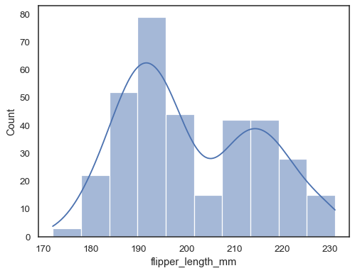    |
| kdeplot      |  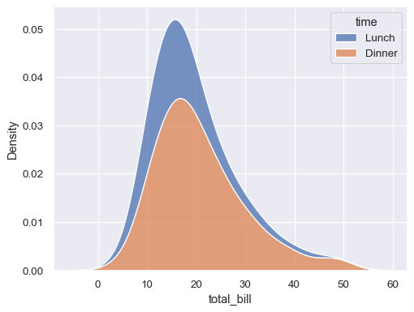    |
| boxplot      |  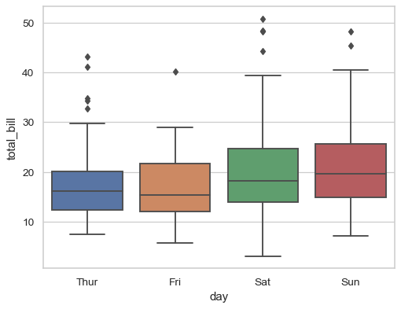    |
| barplot      |  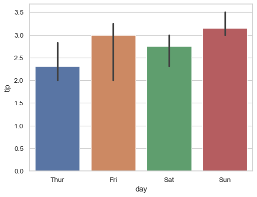    |
| jointplot      |  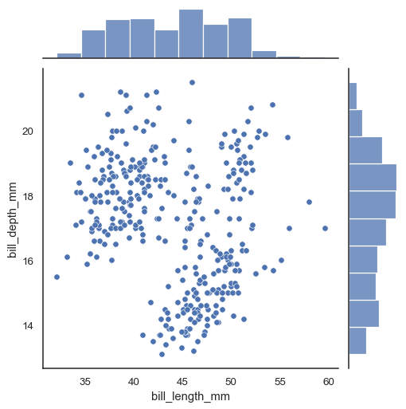    |
| swarmplot      |  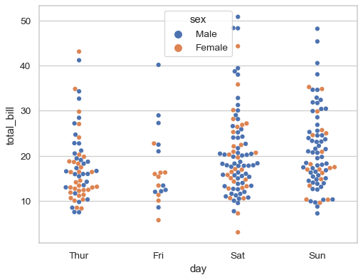    |
| violinplot      |  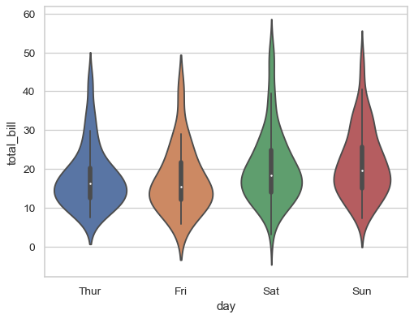    |
| facetgrid      |      |
| pairplot      |  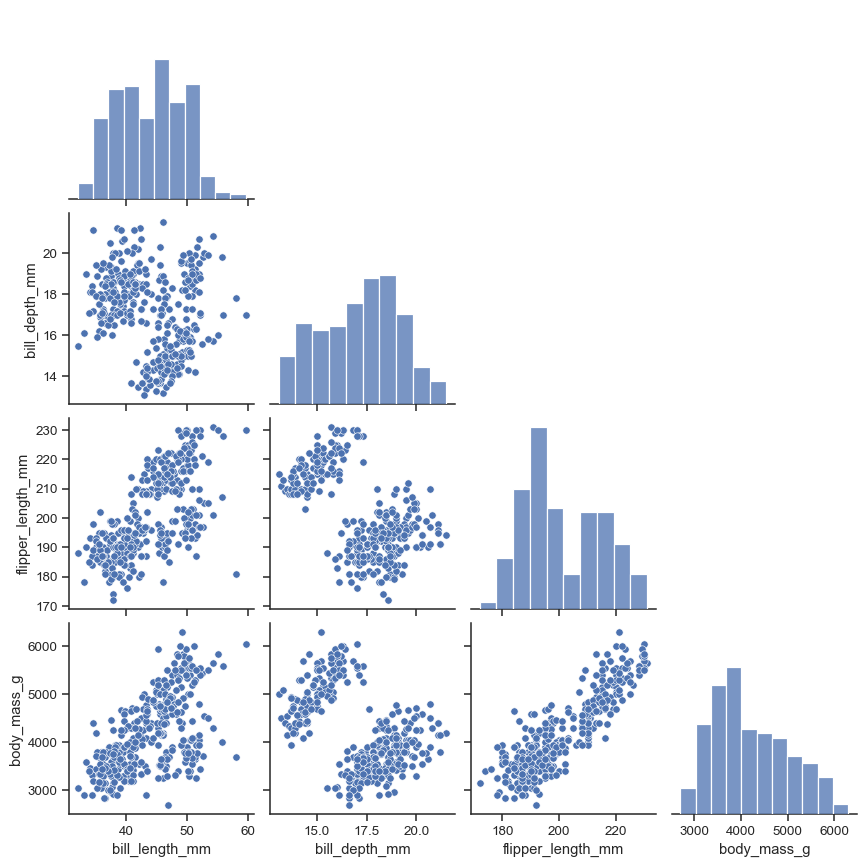    |
| boxenplot      |  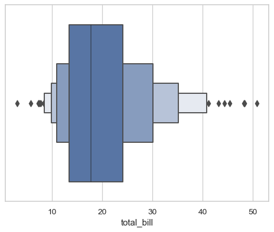    |
| scatterplot      |  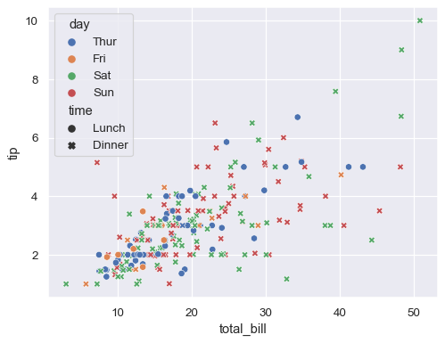    |
| regplot      |  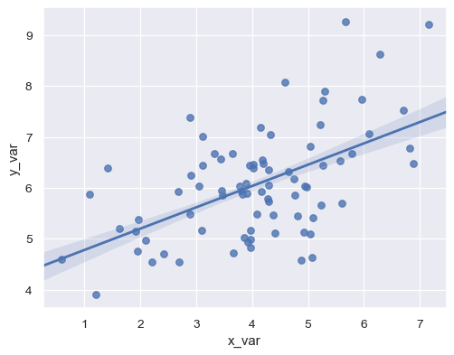    |
| lineplot      |  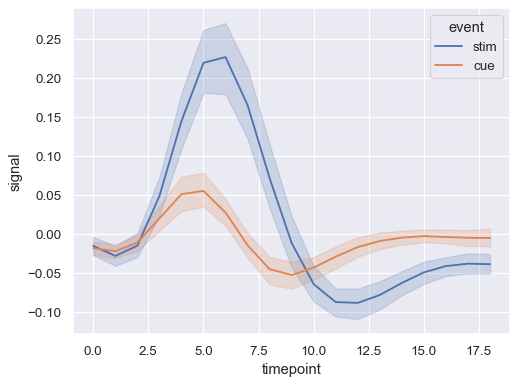    |
| heatmap      |  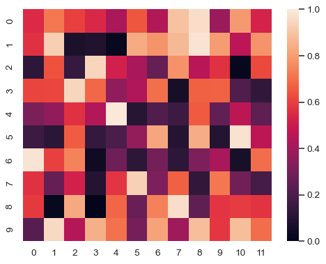    |